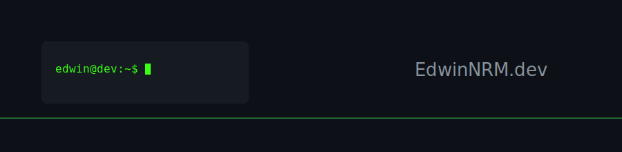

## Hey. 👋 Nice to meet you!

```csharp
public class ProfessionalProfile 
{
    public string Name => "Edwin N. R. Medina";
    public string Location => "Goiás, Brazil";
    
    public string[] Degrees => new[] { 
        "Software Engineering", 
        "Mechanical Engineering" 
    };

    public List<string> Focus => new List<string> { 
        "Full Stack Development", 
        "System Automation", 
        "Pixel Art" 
    };
}
```

- 🎓 Software Engineer & Mechanical Engineer
- 💻 Open for new challenges in Full Stack Development
- 🚀 Building scalable solutions with C#, Python, and JavaScript (Frameworks included!)
- 🎮 Pixel art enthusiast and Gamer

##  Tech Stack
<div style="display: inline-block">
  
  
  
  
  
  
  
  
  
  
  
</div>
<br><br>

## Guestbook

<div>
  <a href="https://github.com/EdwinNRM/EdwinNRM/issues/4">
    
  </a>
</div>

<!-- Guestbook -->
| Name | Date | Message |
|---|---|---|
| <a href="https://github.com/WillianAsouz4"> WillianAsouz4</a> |2/8/2026, 9:44:31 PM|oq isso faz?|
| <a href="https://github.com/joaosantosg"> joaosantosg</a> |2/8/2026, 1:21:31 PM|Você é especial demais, nunca esquece disso.|
| <a href="https://github.com/EdwinNRM"> EdwinNRM</a> |2/8/2026, 5:40:00 AM|Será que vai?|
<!-- /Guestbook -->

  ## Stay in touch!
 
<div> 
  <a href="https://instagram.com/edwinnichollas" target="_blank"></a>
  <a href="https://discord.com/users/the_godwin" target="_blank"></a> 
  <a href = "mailto:edwinmedina@gmail.com"></a>
  <a href="https://br.linkedin.com/in/edwinnrmedina" target="_blank"></a> 
</div>

<div align="left"> 
  <p>  </p>
</div>

---


