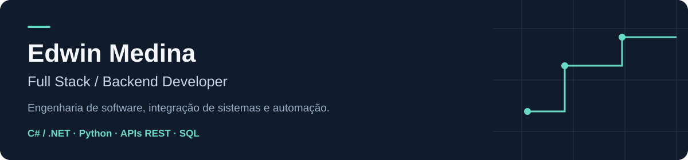
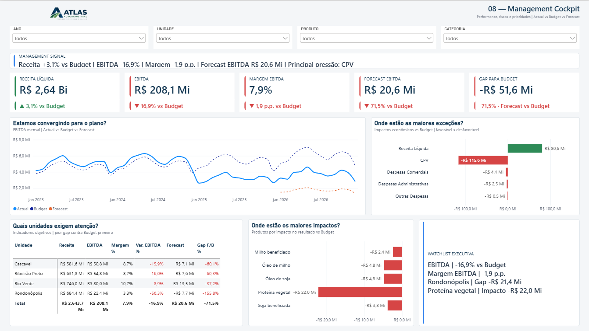

# Olá, sou Edwin Medina

**Desenvolvedor Full Stack / Backend · C# / .NET · Python · APIs REST**

São José do Rio Preto, SP, Brasil

[LinkedIn](https://www.linkedin.com/in/edwinnrmedina/) · [E-mail](mailto:edwinnrm@gmail.com) · [Currículo em PDF](CV_Edwin_Medina.pdf)

Desenvolvo e integro sistemas com foco em código legível, confiabilidade e evolução de aplicações. Minha experiência reúne engenharia de software, automação de processos e conhecimento de negócio, com atuação em todo o ciclo de desenvolvimento: dos requisitos à sustentação em produção.

Atualmente, sou **Desenvolvedor Full Stack na Anbetec** e **Professor Formador na Universidade Evangélica de Goiás**, no curso de Análise e Desenvolvimento de Sistemas. Ensino desenvolvimento de APIs, integração de sistemas e testes de software.

## Experiência em números

- **Mais de 20.000 usuários** atendidos pelos sistemas em cujo desenvolvimento e manutenção atuei na Framework Digital.
- **4 desenvolvedores** na equipe que liderei, com gestão de **11 projetos internos**.
- **1 ano como Product Owner**, conectando clientes, stakeholders e desenvolvimento para organizar backlog e priorizar entregas.

Minha trajetória anterior em controladoria, logística e operações também orienta a forma como construo software: entender o processo, estruturar os dados e automatizar o que gera valor.

## Tecnologias e áreas de atuação

| Área | Tecnologias e práticas |
| --- | --- |
| Backend e integração | C#, .NET, Python, FastAPI, Node.js, APIs REST |
| Dados e automação | SQL, bancos relacionais e NoSQL, Excel/VBA, VBS, dashboards e relatórios |
| Desenvolvimento web | JavaScript; React, TypeScript e Next.js nos projetos de portfólio |
| Engenharia de software | Git, Docker, testes de software, análise de requisitos e manutenção de sistemas |
| Sistemas corporativos | Integrações e dados de SAP, TOTVS Datasul e TOTVS Protheus |

## Projetos em destaque

Projetos pessoais que demonstram desenvolvimento de aplicações, integração de serviços e análise de dados. O código e a documentação estão disponíveis em cada repositório.

| Projeto | O que demonstra | Tecnologias |
| --- | --- | --- |
| **[ResumeOS](https://github.com/EdwinNRM/ResumeOS)** | Editor de currículos por blocos, pré-visualização e verificações de estrutura orientadas a ATS. Integra frontend e API para exportação via impressão do navegador. | React, TypeScript, Zustand, Python, FastAPI |
| **[Atlas Match Engine](https://github.com/EdwinNRM/atlas-match-engine)** | Serviço de agregação de vagas e classificação por compatibilidade, com critérios baseados no perfil e painel de resultados. | Python, FastAPI, HTTPX, Jinja2 |
| **[Kleos](https://github.com/EdwinNRM/Kleos)** | Portfólio técnico com apresentação de trajetória, decisões e evidências de projetos em uma interface editorial. | Next.js, React, TypeScript, Tailwind CSS |
| **[Atlas Agroindustrial](https://github.com/EdwinNRM/AtlasAgroindustrial)** | Case de BI financeiro: geração de dados sintéticos, modelo dimensional e oito páginas de análise de DRE, orçamento e forecast. | Python, pandas, Power BI, Power Query, DAX |

### Preview: Atlas Agroindustrial

*Captura real do projeto. Empresa e dados inteiramente fictícios, criados para demonstração. [Explore as oito páginas e a documentação](https://github.com/EdwinNRM/AtlasAgroindustrial#dashboard).*

## Formação e comunidade

- **Engenharia de Software** — UniEVANGÉLICA, 2025.
- **Engenharia Mecânica** — Universidade Paulista, 2016.
- **Pós-graduação em Inteligência Artificial e Machine Learning** — Universidade Pitágoras Unopar Anhanguera, 2026.
- Atuação como **GitHub Campus Expert**, com treinamentos técnicos e apoio à comunidade acadêmica.
- **Prêmio Schaeffler de Excelência Tecnológica — Honra ao Mérito (2025)**, ouro na Olimpíada de Programação da faculdade (2025) e 1º lugar no Hackathon de Engenharia de Software (2023).

**Idiomas:** inglês avançado e francês básico.

## Vamos conversar

Para conversar sobre desenvolvimento de software, integrações, automação ou ensino: **[edwinnrm@gmail.com](mailto:edwinnrm@gmail.com)** ou **[LinkedIn](https://www.linkedin.com/in/edwinnrmedina/)**.

Além do código

Também gosto de pixel art e jogos. No [meu blog pessoal](https://edwinnrm.github.io/Blog/), exploro uma interface inspirada na web dos anos 2000, construída com Jekyll, SCSS e JavaScript.

Guestbook · mensagens da comunidade

[Deixe uma mensagem](https://github.com/EdwinNRM/EdwinNRM/issues/4).

<!-- Guestbook -->
| Name | Date | Message |
|---|---|---|
| <a href="https://github.com/Thigoo"> Thigoo</a> |7/30/2026, 10:39:29 PM|Oi amigo, você é um amigo.|
| <a href="https://github.com/g3rley"> g3rley</a> |4/13/2026, 9:27:35 PM|Sou fã desse cara!!!|
| <a href="https://github.com/xxspell"> xxspell</a> |2/25/2026, 4:03:53 PM|🫩|
| <a href="https://github.com/GabrielGFC"> GabrielGFC</a> |2/10/2026, 12:41:28 AM|Só passando pra deixar um abraço virtual e dizer que tá mandando bem demais. Continua firme que isso aqui ainda vai longe.|
| <a href="https://github.com/Dheakne"> Dheakne</a> |2/10/2026, 12:20:44 AM|Maior usuário de F.E.V. que eu conheço|
<!-- /Guestbook -->

