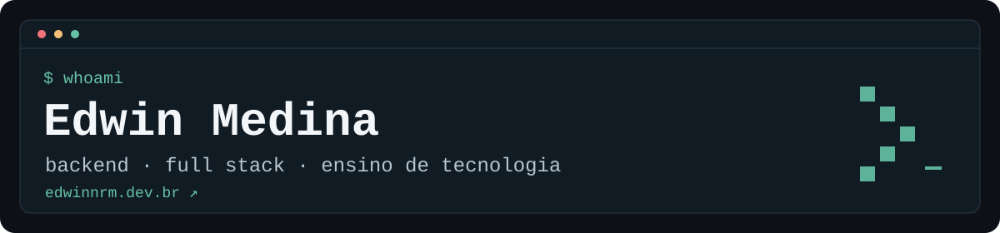

### Oi, eu sou o Edwin 👋

Desenvolvo sistemas e APIs; também ensino outras pessoas a construir os seus. Hoje atuo como **Desenvolvedor Full Stack na Anbetec** e **Professor Formador na Universidade Evangélica de Goiás**.

Passei por engenharia mecânica, controladoria e logística antes de me dedicar ao software. Ficou um hábito bom: entender o problema de perto antes de abrir o editor.

No código, transito entre **C#/.NET, Node.js, TypeScript, React, Python e SQL**. Fora dele, gosto de pixel art e jogos. 🎮

No [meu portfólio](https://edwinnrm.dev.br/), conto a história por trás dos projetos: o problema, as decisões técnicas e o resultado. Os repositórios em destaque aqui no GitHub mostram o código.

[Portfólio](https://edwinnrm.dev.br/) · [Currículo](CV_Edwin_Medina.pdf) · [LinkedIn](https://www.linkedin.com/in/edwinnrmedina/) · [E-mail](mailto:edwinnrm@gmail.com)
